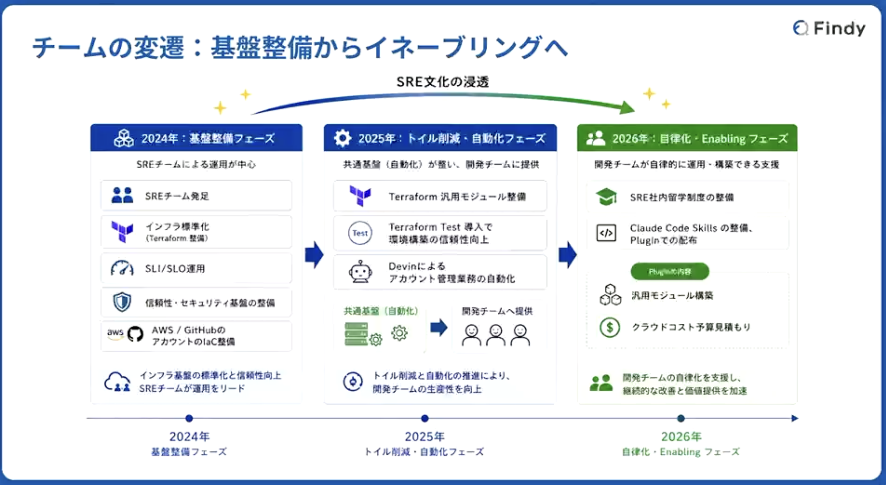
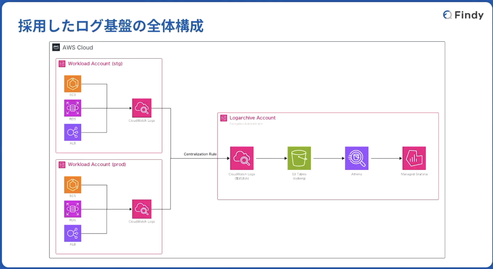

## ファインディにおけるマルチプロダクト横断の次世代ログプラットフォームの設計思想

- 2025年の注力ポイントは年の注力ポイントはTerraformのモジュール整備や自動化
  - ここは同じくらいかも
- 2026年は開発チームの自立化支援
  - ここも同じ

イネーブリング（Enabling）」とは、個人や組織の能力を引き出し、「何かができる状態（可能にすること）」を創り出すこと

- AIの進化で開発スピードが上がっている
- プロダクトが増える
  - それに比例して運用チームが増えているわけではない
  - 個別対応をするとボトルネックになる

### ログ基盤

コストが高くなりすぎない、運用負荷を上げないように設計

SaaSではなくAWSマネージドサービスベース

