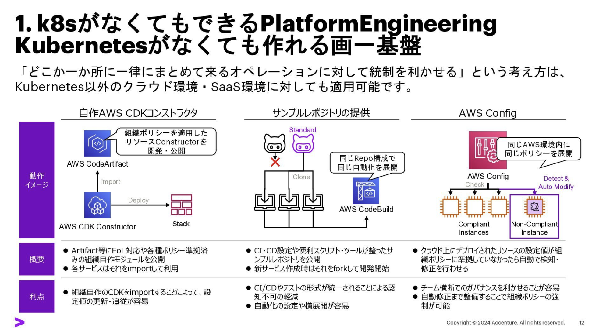
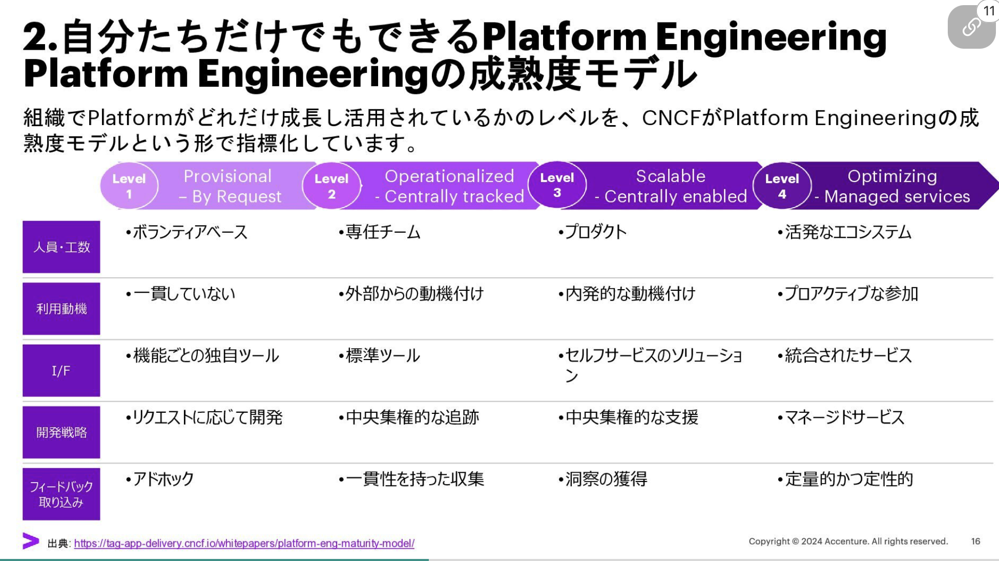

# 小さく始めるPlatformEngineering

- PEはKubernetesと相性が良い
- これはmanifest(kube-api)で操作できる特徴が相性の良さにつながっている
  - これは確かにそう思う。PEで管理まで行うなら。

ただし、なくてもできることはある。

よくある成熟度モデルの話

この話ではレベル１やそれ以前のレベルの取組であってもやらないよりずっといいので、初めてみようと。  
それが許されるチームビルディングが大事。

- うちではレベル２を目標に取り組みを進めている。
- レベル３以降はレベル２までの成果物でニーズなどを拾った上で進めるべきだと考えている

- レベル２の壁
  - 使ってもらう難しさ
  - フィードバックをもらう難しさ

